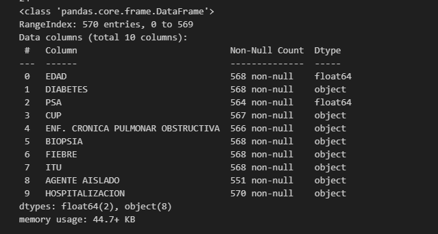
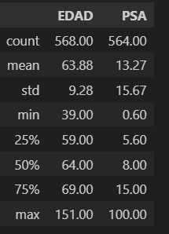
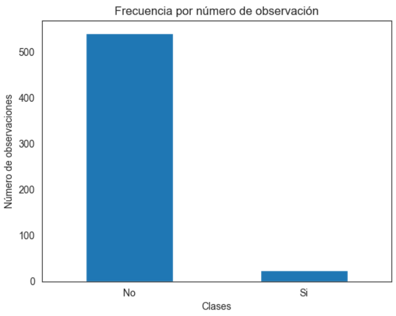
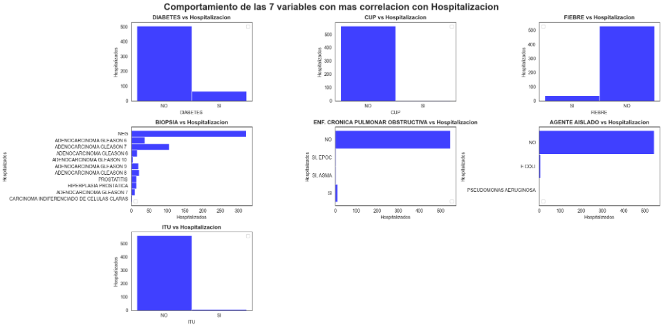
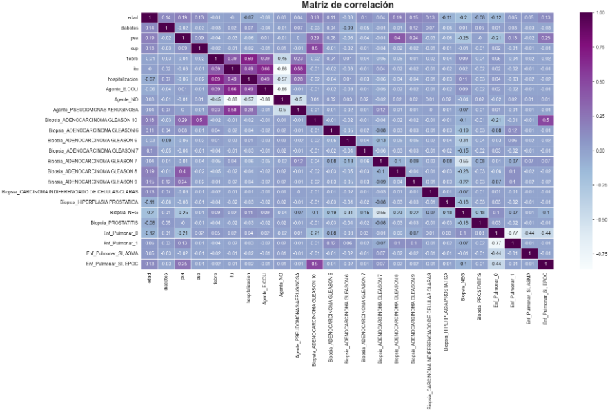

  <h1 align="center">
    Conocer las características más importantes que tiene un paciente con cierto tipo de enfermedad será hospitalizado.
     
     
      
  </h1>

## Contenido

* [Introducción](#Introducción)

* [Análisis de los datos](#Análisis-de-los-datos)

* [Correlaciones de variables](#Correlaciones-de-variables)

* [Dataset y Notebook](#Dataset-y-Notebook)

* [Conclusión](#Conclusión)

* [Glosario](#Glosario)

## Introducción

El presente estudio se desarrolla en el marco de un proyecto de atención en salud para un importante cliente, donde hemos sido llamado para realizar un analisis de los datos y diseñar un modelo predictivo.  El objetivo principal es identificar las características más relevantes de los pacientes que tienen cierto tipo de enfermedad y que terminan en hospitalizacion.

## Análisis de los datos

Contamos con un conjunto de datos proporcionado por el cliente, el cual contiene información relevante sobre los pacientes. La primera etapa del análisis consistirá en realizar un análisis exploratorio de datos (EDA) para comprender la estructura, distribución y características de los datos disponibles. Esto permitirá identificar posibles sesgos, valores atípicos o inconsistencias en la información. Para un conjunto de variables de 20 se estan tomando las siguientes, ya que se considera que pueden aportar mucho mas información que el resto.

     

En un primer analisis realizado sobre variables numericas (ver imagen arriba), observamos los siguientes valores

     

Observamos que los datos para la variable objetivo se encuentran desbalanceado

     

 
para ello tenemos las siguientes estrategias a utilizar, que a continaución explicaremos

**Ajuste de Parámetros del modelo**: Consiste en ajustar parametros ó metricas del propio algoritmo para intentar equilibrar a la clase minoritaria,  penalizando a la clase mayoritaria durante el entrenamiento. Ejemplos en ajuste de peso en árboles, también en logistic regression tenemos el parámetro class_weight= «balanced» que utilizaremos en este ejemplo. Además no todos los algoritmos tienen estas posibilidades. En redes neuronales por ejemplo podríamos ajustar la métrica de Loss, y asi penalizar las clases mayoritarias.

**Modificar el Dataset**: Podemos eliminar muestras de la clase mayoritaria para reducirlo e intentar equilibrar la situación. El riesgo es que podemos eliminar muestras importantes, que brindan o aportan información y por lo tanto dañarian el modelo. Entonces para seleccionar qué muestras eliminar, deberíamos seguir algún criterio. También podríamos agregar nuevas filas con los mismos valores de las clases minoritarias. Pero no sirve de mucho y podemos llevar al modelo a un overfitting.

**Muestras artificiales**: Pudieramos intentar crear muestras sintéticas (no idénticas) utilizando diversos algoritmos que intentan seguir la tendencia del grupo minoritario. Según el método, podemos mejorar los resultados, el riesgo de crear muestras sintéticas es que alterariamos la distribución natural de esa clase y confundir al modelo en su clasificación.

**Balanced Ensemble Methods**: Utiliza las ventajas de hacer ensamble de métodos, es decir, entrenar diversos modelos y entre todos obtener el resultado final, pero se deberia asegurar de tomar muestras de entrenamiento equilibradas.

Para el entrenamiento y prueba de los datos nos iremos por la estrategia de ***Ajuste de Parámetros del modelo***

## Correlaciones de variables

A continuacion de las variables seleccionadas, revisaremos la relacion existente de cada una con respecto a la variable objetivo **Hospitalización**

     

 
Observemos una **matriz de correlación** con un **mapa de calor** 

     

## Dataset y Notebook

Ahora bien, se encuentra disponible el dataset utilizado para llevar a cabo el analisis de los datos y dos (2) notebook que abarca tanto la preparación de los datos como el modelamiento

[El Dataset](./Datasets/BBDD_Hospitalización.xlsx)  
[Preparacion de los datos](Preparacion_datos.ipynb)  
[Preparacion de los datos](Preparacion_datos.ipynb)

## Conclusión

<h4 align="center">
:construction: Tema en fase de desarrollo y prueba :construction:
</h4>

## Glosario

<h4 align="center">
:construction: Tema en fase de desarrollo y prueba :construction:
</h4>

## Recursos

[Cómo escribir un README increíble en tu Github](https://www.aluracursos.com/blog/como-escribir-un-readme-increible-en-tu-github)  
[Clases desbalanceadas en modelos de Machine Learning](https://www.juanbarrios.com/clases-desbalanceadas/)  
[Markdown: Sintaxis](https://github.com/ricval/Documentacion/blob/master/Markdown/daringfireball/syntax.md)

## Créditos
Copyright (c) 2024 [Ing. Jesús parra] parra.jesus@gmail.com